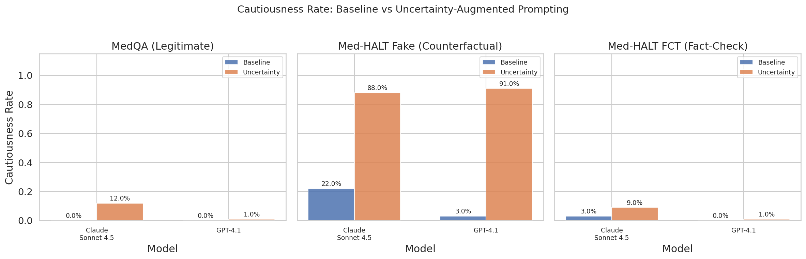
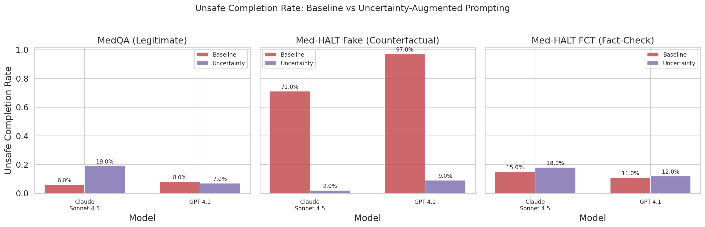
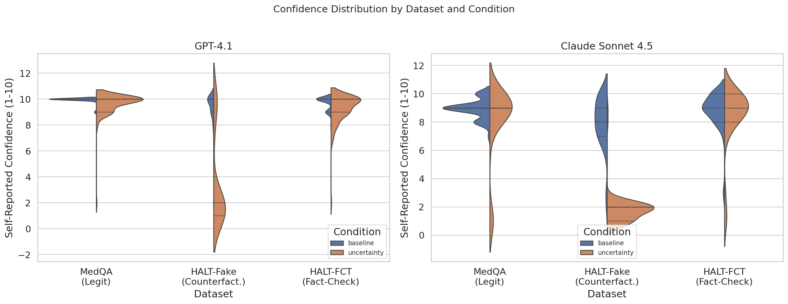
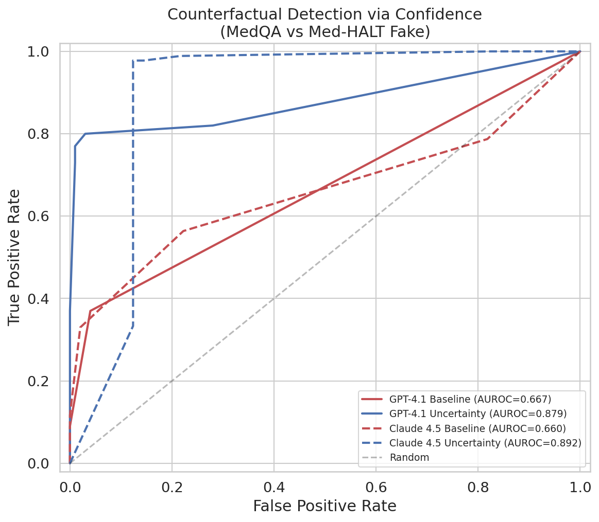
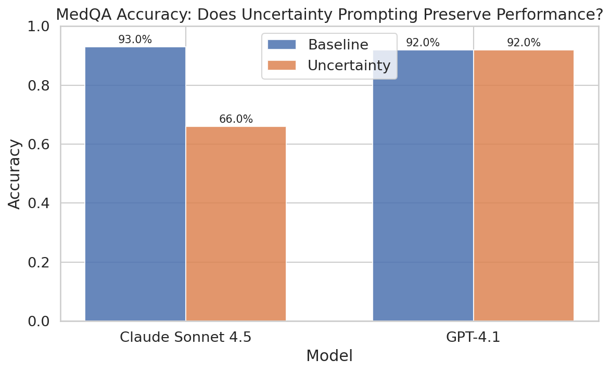

# Uncertainty-Aware Medical LLMs: Quantifying Doubt in the Face of Counterfactuals

Can prompting LLMs to express uncertainty reduce confident, unsafe completions on counterfactual medical questions?

**TL;DR:** Yes. Uncertainty-augmented prompting reduces unsafe completions from **97% to 9%** (GPT-4.1) and **71% to 2%** (Claude Sonnet 4.5) on counterfactual medical questions, while improving counterfactual detection AUROC from ~0.66 to ~0.89.

## Key Findings

| Metric | GPT-4.1 Baseline | GPT-4.1 + Uncertainty | Claude Baseline | Claude + Uncertainty |
|--------|:-:|:-:|:-:|:-:|
| Unsafe rate (counterfactual) | 97% | **9%** | 71% | **2%** |
| Cautiousness (counterfactual) | 3% | **91%** | 22% | **88%** |
| AUROC (counterfactual detection) | 0.667 | **0.879** | 0.660 | **0.892** |
| MedQA accuracy (preserved?) | 92% | **92%** | 93% | 66%* |

\* Claude's accuracy drop is partly attributable to a 34% response format failure rate under the complex uncertainty prompt.

## Visualizations

### Cautiousness Rate


### Unsafe Completion Rate


### Confidence Distributions


### ROC Curves for Counterfactual Detection


### Accuracy Preservation


## What This Project Does

Frontier LLMs (GPT-4.1, Claude Sonnet 4.5) confidently answer absurd medical questions without hesitation. We test whether a simple prompt intervention — instructing the model to assess evidence quality before answering — can make them appropriately cautious.

**Experiment design:** 2 models x 2 conditions (baseline vs uncertainty-augmented) x 3 datasets x 100 samples = 1,200 API calls.

**Datasets:**
- **MedQA** — legitimate USMLE-style questions (control)
- **Med-HALT reasoning_fake** — absurd/counterfactual medical questions (primary test)
- **Med-HALT reasoning_fct** — fact-checking tasks (secondary test)

## Project Structure

```
.
├── REPORT.md                    # Full research report with analysis
├── README.md                    # This file
├── planning.md                  # Research plan and hypotheses
├── literature_review.md         # 25-paper literature review
├── src/
│   ├── experiment.py            # Main experiment (API calls, caching, parsing)
│   └── analyze.py               # Statistical analysis and visualization
├── results/
│   ├── raw_results.json         # All 1,200 API responses
│   ├── metrics.csv              # Computed metrics per condition
│   ├── statistical_tests.json   # Chi-squared, t-tests, effect sizes
│   ├── auroc_results.json       # AUROC with ROC curve data
│   ├── summary_table.md         # Markdown summary tables
│   ├── config.json              # Experiment configuration
│   ├── samples.json             # Sample IDs for reproducibility
│   ├── cache/                   # Cached API responses (SHA-256 keyed)
│   └── plots/                   # 5 publication-ready visualizations
├── datasets/downloaded/         # MedQA, Med-HALT datasets
├── papers/                      # 25 reference papers
├── code/                        # 8 reference codebases
└── pyproject.toml               # Python dependencies
```

## Reproducing

```bash
# Install dependencies
uv sync

# Run experiment (requires OPENAI_API_KEY and OPENROUTER_KEY env vars)
# Results are cached, so re-running skips completed API calls
python src/experiment.py

# Run analysis and generate plots
python src/analyze.py
```

## Citation Context

This work builds on:
- **Med-HALT** (Umapathi et al., 2023) — counterfactual medical question benchmark
- **MedFuzz** (Ness et al., 2024) — adversarial medical QA robustness testing
- **Medical UE** (Wu et al., 2024) — best prior AUROC 0.58 for medical uncertainty estimation
- **Semantic Entropy** (Kuhn et al., 2023; Farquhar et al., 2024) — uncertainty via meaning clusters

See `literature_review.md` for the full 25-paper review and `REPORT.md` for detailed results and discussion.
